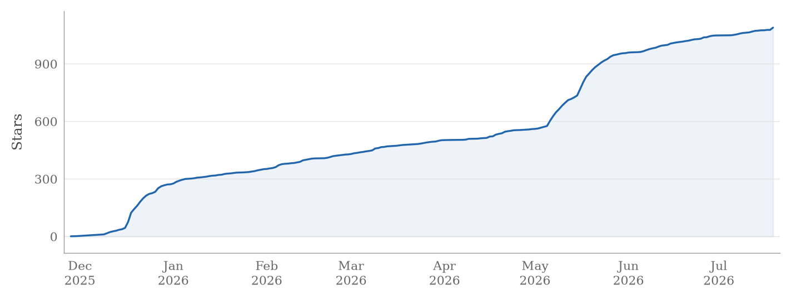

### Mathematics · Computer Science · ML/DL · Open Source

  关注应用数学 计算机科学与机器学习相关研究 CryptoTrading业余爱好者 热爱开源社区。

  
  
  
  

---

### 🧠 Background

<table>
  <tr>
    <td valign="top" width="50%">
      <strong>Research & Engineering</strong>
      <ul>
        <li>LLM 评测、可观测性与 Agent 工作流</li>
        <li>分布式推理、调度与系统优化</li>
        <li>ML/DL/RL 驱动的网络安全</li>
        <li>高性能 C++ 基础设施与服务器系统</li>
      </ul>
    </td>
    <td valign="top" width="50%">
      <strong>Open Source</strong>
      <ul>
        <li><a href="https://github.com/vllm-project/vllm">vllm</a> — 文档、测试与 Bug 修复</li>
        <li><a href="https://github.com/zimingttkx/future-agi">future-agi</a> — LLM 评测与 Agent 开发</li>
      </ul>
    </td>
  </tr>
</table>

### 🚀 Projects

<table>
  <tr>
    <td><a href="https://github.com/zimingttkx/future-agi">future-agi</a></td>
    <td>LLM 评测、观测与优化平台</td>
    <td><a href="https://github.com/zimingttkx/QuantumFlow">QuantumFlow</a></td>
    <td>分布式 LLM 推理调度框架</td>
  </tr>
  <tr>
    <td><a href="https://github.com/zimingttkx/Network-Security-Based-On-ML">Network-Security</a></td>
    <td>机器学习网络安全检测系统</td>
    <td><a href="https://github.com/zimingttkx/ConcurrentCache">ConcurrentCache</a></td>
    <td>C++17 高性能分布式缓存系统</td>
  </tr>
  <tr>
    <td><a href="https://github.com/zimingttkx/AI-Practices">AI-Practices</a></td>
    <td>机器学习与深度学习教程</td>
    <td><a href="https://github.com/zimingttkx/WebServer">WebServer</a></td>
    <td>WebSocket 聊天服务器</td>
  </tr>
</table>

### 🛠 Stack

  
  
  
  
  
  
  
  

### 📈 Star History

  

